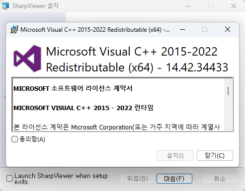

# Install

**DPS Board** 제어 프로그램의 설치 절차입니다. 아래 단계를 따라 프로그램을 올바르게 설치하세요.

 

---

 

## 1. 설치 프로그램 다운로드

제공된 설치 파일을 **로컬 컴퓨터**에 다운로드합니다.

 

---

 

## 2. 설치 프로그램 실행

다운로드한 파일을 실행하여 설치 과정을 시작합니다.

 

---

 

## 3. 사용자 사용권 계약

사용자 사용권 계약서에 동의함을 확인하는 절차입니다.  
**동의하지 않을 경우 설치가 진행되지 않습니다.**

 

---

 

## 4. 폴더 설치 경로 설정

기본 설치 경로를 선택하거나 사용자가 원하는 **커스텀 경로**를 지정할 수 있습니다.  
 **VC Redis**가 이미 설치되어 있는 경우, 해당 옵션을 해제하여 중복 설치를 방지합니다.

 

---

 

## 5. 설치 준비 완료

설치 준비가 완료되면, **설치** 버튼을 클릭하여 실제 설치를 시작합니다.

 

---

 

## 6. 설치 중

설치 과정이 진행됩니다. 설치가 완료될 때까지 기다려 주세요.

 

---

 

## 7. VC_redist_x64 설치

**VC_redist_x64**는 해당 프로그램 실행에 필요한 필수 패키지입니다. 반드시 설치해야 정상적인 동작이 보장됩니다.

 

---

 

## 8. 설치 완료

설치가 완료되었습니다.  
**Launch** 체크박스를 선택하고 **마침** 버튼을 클릭하여 프로그램을 바로 실행할 수 있습니다.

 

---

 

## 9. 프로그램 실행 확인

프로그램이 정상적으로 실행되었음을 확인할 수 있습니다. 이제 DPS 보드를 제어할 준비가 완료되었습니다.
