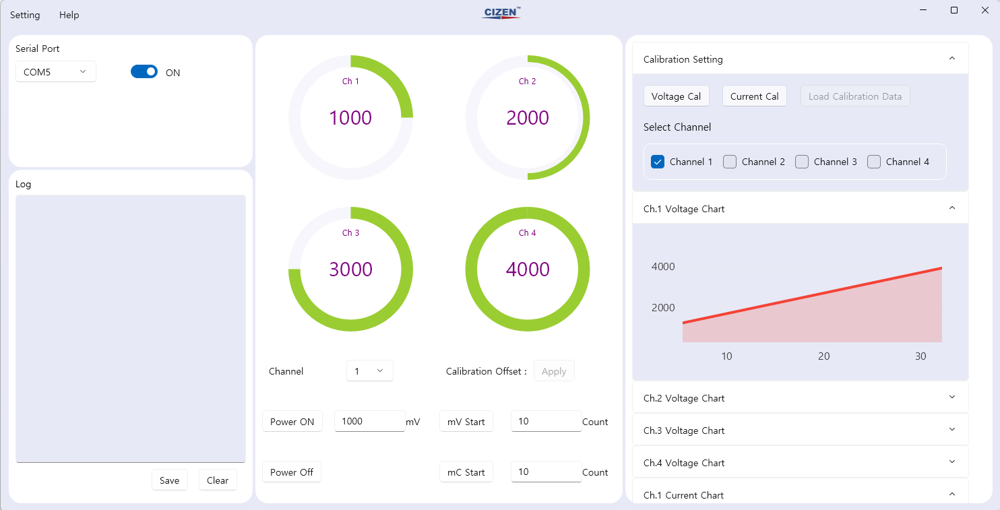
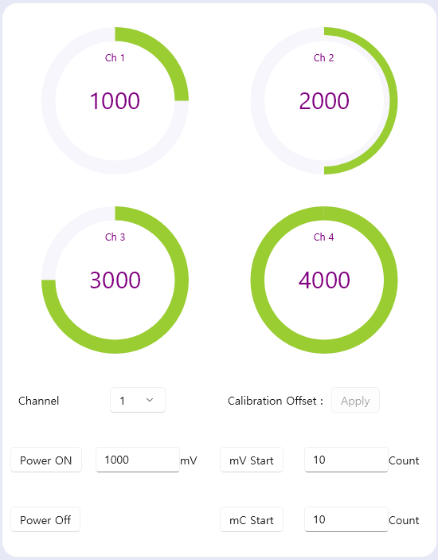
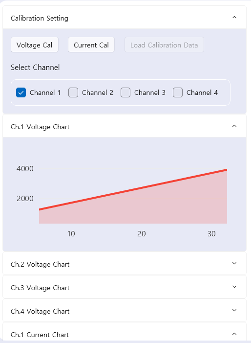
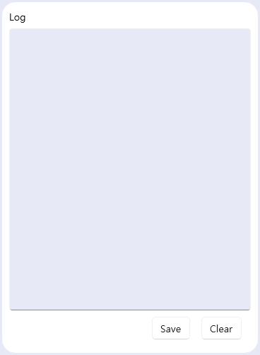
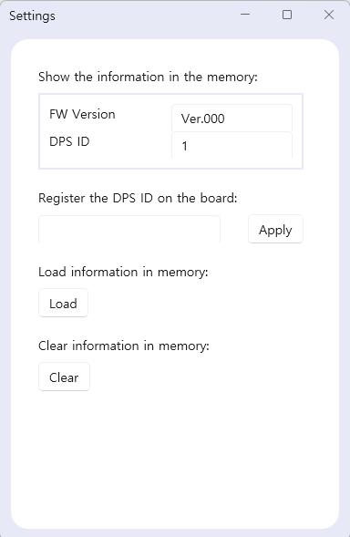

# UI

## Description

DPS 보드는 다양한 기능을 제공하는 소프트웨어입니다. 이 소프트웨어는 다음과 같은 기능을 제공합니다:

- **연결** : DPS 보드와 연결하여 제어할 수 있습니다.
- **로그 확인** : 사용자가 로그를 확인하고 문제를 추적할 수 있습니다.
- **제어(Control)** : DPS 보드를 제어하고 설정할 수 있습니다.
- **교정(Calibration)** : 보드를 더욱 정확하게 사용하기 위한 교정 기능을 제공합니다. 그 결과를 **그래프** 형태로 확인할 수 있습니다.

 

---

 

## Connect

 **Connect** 화면에서는 **USB로 연결된 DPS 보드** 를 개별적으로 연결할 수 있습니다:

- 사용자는 지정된 **포트(Port)** 를 설정하여 각 **DPS 보드의 전원 On/Off 제어** 를 할 수 있습니다.
- 이를 통해 **보드 제어** 가 이루어집니다.

 

---

 

## Control Voltage

 **Current Voltage** 화면에서는 각 채널에 대해 **전압(Voltage)** 을 확인할 수 있습니다:

-  **DPS 보드의 전압 상태** 를 실시간으로 모니터링할 수 있습니다.

 **Control Voltage** 기능을 통해 각 채널에 대해 개별적으로 **전압(Voltage)** 을 설정할 수 있습니다:

- 사용자는 **현재 설정된 전압** 과 **전류(Current)** 를 실시간으로 측정하고 확인할 수 있습니다.
-  **교정(Calibration)** 을 진행한 후, 각 **DPS 보드** 에 개별적으로 적용할 수 있습니다.

 

---

 

## Calibration

 **Calibration** 과정을 통해 **DPS 보드** 를 더욱 정확하게 사용할 수 있습니다:

- **개별적인 제어(Control)** 가 가능하며, **결과를 차트** 형태로 확인할 수 있습니다.
- **DPS 보드** 의 성능을 최적화하는 중요한 기능입니다.

 

---

 

## Log

 **Log** 화면에서는 측정된 **전압** 및 **전류** 값과 소프트웨어 사용 중 발생한 **에러**를 확인할 수 있습니다.

- 사용자는 **측정된 전압** 및 **전류** 값을 실시간으로 확인할 수 있습니다.
- 발생한 **에러 메시지**를 통해 문제의 원인을 빠르게 파악하고, 신속하게 대응할 수 있습니다.

 

---

 

## Setting

 **Setting** 화면에서는 다음과 같은 기능을 제공합니다:

- **펌웨어(FW) 버전** 과 **보드 ID** 를 확인할 수 있습니다.
- 사용자는 **DPS ID** 를 설정하고, **저장된 보드 정보** 를 불러오거나 저장할 수 있습니다.

이 기능을 통해 **DPS 보드 관리** 가 편리하게 이루어집니다.

