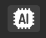

# Capture Page

## Description

Capture 페이지에서는 캡처된 프레임을 확인하거나 저장할 수 있으며, 비디오를 불러와 재생 및 정지할 수 있습니다.
또한, **AI 모델을 활용한 객체 탐지 기능을 지원하여 실시간 분석이 가능합니다.**

## Save Image

이 기능을 사용하여 다양한 형식의 이미지를 저장할 수 있습니다.

- RGB 이미지 저장을 통해 변환된 프레임을 저장할 수 있습니다.
- 원시(Raw) 이미지 저장 기능을 통해 원본 데이터를 저장할 수 있습니다.
- RGB 변환 전후의 이미지를 각각 저장하여 비교할 수 있습니다.

## Video Setting 

비디오 설정 기능을 통해 사용자가 직접 비디오를 불러와 재생 및 정지할 수 있습니다.

-  **비디오 불러오기 (Load)**를 통해 원하는 영상을 선택할 수 있습니다.
- 비디오 재생 (Play) 버튼을 누르면 선택한 영상이 재생됩니다.
- 비디오 정지 (Stop) 버튼을 누르면 영상이 멈춥니다.

## AI Detection 

**AI Detection** 기능을 활용하여 영상 내 객체를 실시간으로 감지할 수 있습니다.

- 제공된 데모 AI 모델을 활용하여 객체 탐지 기능을 수행합니다.
- AI Detection이 활성화되면, 감지된 결과가 영상에 실시간으로 표시됩니다.
